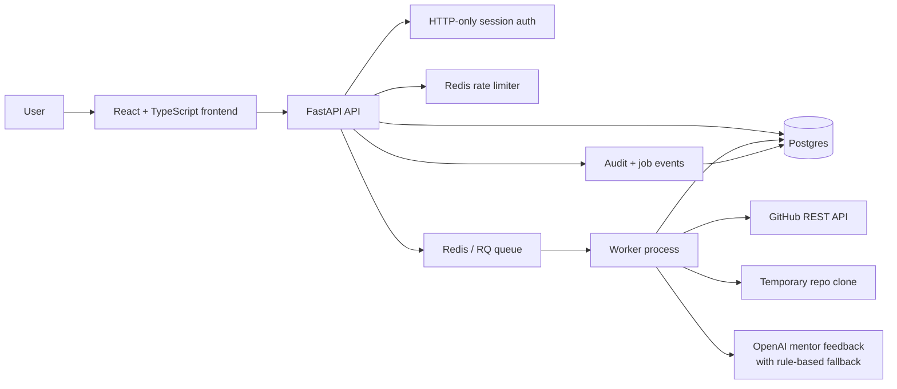
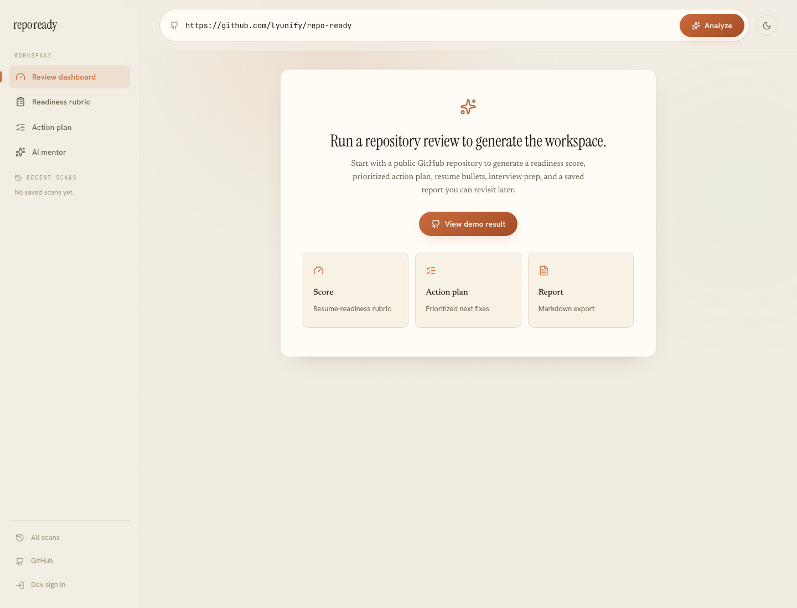
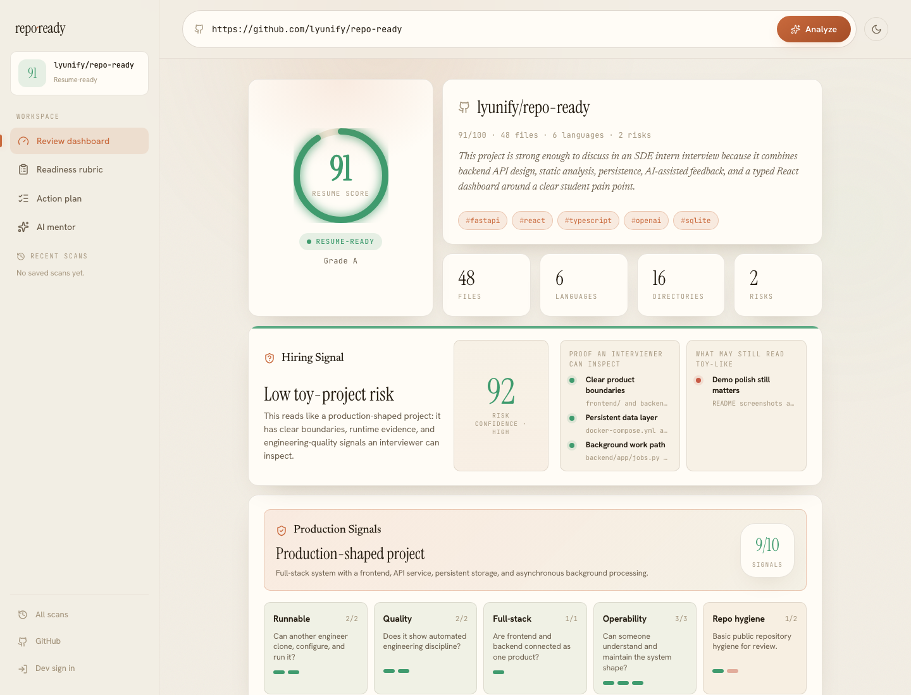
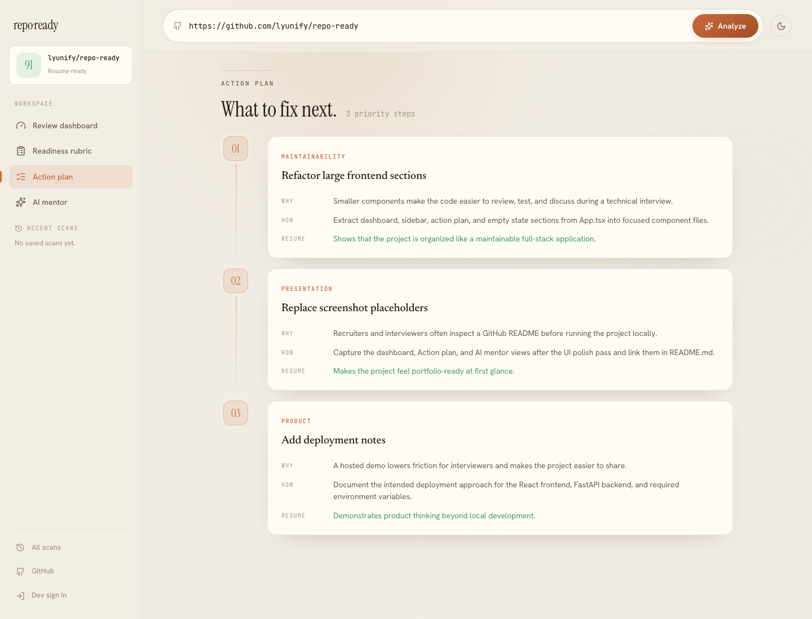
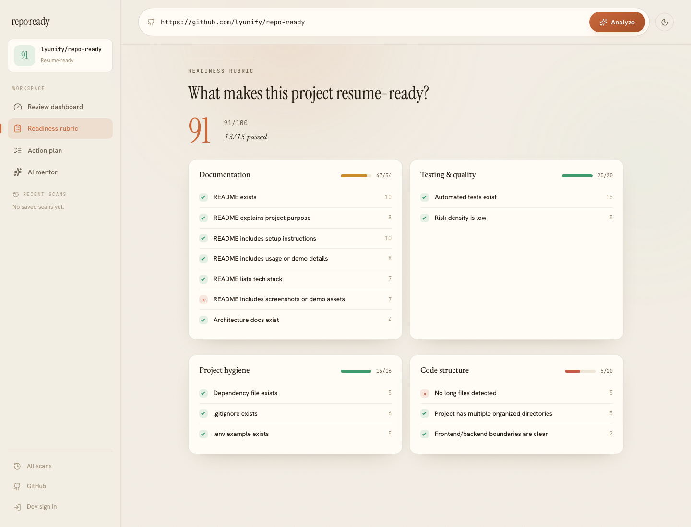
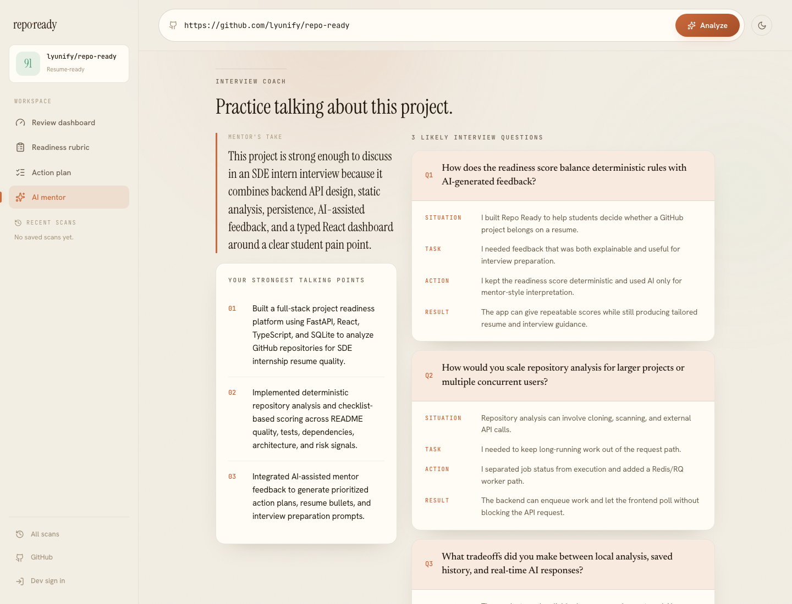

# repo-ready

[](https://github.com/lyunify/repo-ready/actions/workflows/ci.yml)

**Live demo:** [www.repo-ready.com](https://www.repo-ready.com)

Repo Ready is a full-stack repository readiness platform for CS students preparing for SDE internship applications. It analyzes a public GitHub project, scores whether the repo is resume-ready, generates prioritized fixes, and turns technical signals into resume bullets and interview talking points.

## Why This Project Exists

Students often build projects but struggle to judge whether a repository is strong enough for a resume or technical interview. Repo Ready gives a concrete answer by checking documentation, tests, structure, dependency files, deployment signals, risk signals, GitHub metadata, and end-to-end project polish.

## Production Backend Highlights

- **Async job architecture:** FastAPI returns a `job_id` immediately while Redis/RQ workers run long repository scans outside the request path.
- **Persistent job state:** Postgres stores job status, analysis history, user sessions, audit events, and job progress events.
- **Session-scoped access control:** HTTP-only cookie sessions protect saved history and job status from cross-user access.
- **Redis-backed rate limiting:** `/api/analyze` is limited per user or anonymous IP to protect expensive clone/analyze work.
- **Audit logging:** Login, logout, rejected analysis requests, started analyses, and denied job views are stored as structured events.
- **Job progress timeline:** Each analysis records lifecycle events such as `queued`, `running`, `progress`, `done`, and `failed`.
- **Schema evolution:** Alembic migrations manage the database schema and include repair migrations for legacy local dev databases.
- **Operational checks:** `/health/live` checks process liveness; `/health/ready` checks database and Redis readiness.
- **Quality gates:** pytest, ruff, mypy, Vitest, frontend production build, and GitHub Actions CI.

## Architecture



The API keeps request handling thin: it validates input, checks authorization, applies rate limits, creates a persistent job, and hands long-running work to Redis/RQ. Worker processes clone the repository, run static analysis, enrich results with GitHub metadata, generate readiness feedback, and persist results for later review.

More detail: [docs/architecture.md](docs/architecture.md)

## Tech Stack

- **Frontend:** React, TypeScript, Vite, Vitest
- **Backend:** FastAPI, Python, SQLAlchemy, Pydantic
- **Database:** Postgres in Docker, SQLite-friendly tests/local mode
- **Migrations:** Alembic
- **Queue/cache:** Redis + RQ
- **AI:** OpenAI API with rule-based fallback
- **Infrastructure:** Docker Compose, health/readiness endpoints
- **Quality:** pytest, ruff, mypy, GitHub Actions

## Core Features

- Analyze a public GitHub repository URL.
- Score resume readiness with deterministic checklist rules.
- Inspect languages, file counts, directories, largest files, docs, tests, dependency manifests, CI, deployment config, and risk signals.
- Enrich reports with GitHub metadata such as description, topics, license, homepage, and fork status.
- Generate prioritized action plans with why/how/resume-impact explanations.
- Generate AI mentor feedback, resume bullets, STAR-style interview questions, and next steps.
- Save and reopen analysis history.
- Export a Markdown readiness report.
- Track background job progress through a persisted timeline.

## Product Walkthrough

### Start With A Repository URL

Paste a public GitHub repository URL to start a readiness review. The app is built for students who need a concrete answer to whether a project is strong enough for a resume or technical screen.



### Review Dashboard

The main dashboard summarizes repository quality, languages, risk signals, and a hiring-oriented toy-project risk readout. The goal is to make production signals visible quickly, not just produce a generic AI score.



### Action Plan

The action plan turns failed readiness checks into prioritized fixes with why it matters, how to improve it, and what resume signal the fix creates.



### Readiness Rubric

The rubric keeps the score explainable by separating deterministic checklist signals such as README quality, tests, dependency files, deployment config, API docs, and frontend/backend integration.



### Interview Coach

The mentor view converts repository analysis into resume bullets, interview questions, STAR-style talking points, and follow-up work that a student can actually use.



## Run The Full Stack

Docker Compose starts the production-style local stack: React frontend, FastAPI API, Redis/RQ worker, Postgres, and Redis.

```bash
docker compose up --build -d
```

Open:

- Frontend: `http://127.0.0.1:5173`
- API docs: `http://127.0.0.1:8000/docs`
- Readiness: `http://127.0.0.1:8000/health/ready`

Useful commands:

```bash
docker compose ps
docker compose logs -f api worker
docker compose down
```

## Local Development

Backend:

```bash
cd backend
python3 -m venv .venv
source .venv/bin/activate
pip install -r requirements.txt
cp .env.example .env
alembic upgrade head
uvicorn app.main:app --reload
```

Frontend:

```bash
cd frontend/web
npm install
npm run dev
```

Optional AI feedback:

```bash
OPENAI_API_KEY=your_api_key_here
OPENAI_MODEL=gpt-4o-mini
```

The app still works without an OpenAI key because mentor feedback has a local fallback.

## API Surface

- `GET /health/live`: process liveness.
- `GET /health/ready`: database and Redis readiness.
- `POST /api/auth/dev-login`: create a local development session.
- `GET /api/auth/me`: return current user session.
- `POST /api/auth/logout`: clear the session.
- `POST /api/analyze`: enqueue a GitHub repository analysis job.
- `GET /api/jobs/{job_id}`: poll job status and return the result when complete.
- `GET /api/jobs/{job_id}/events`: return the persisted job progress timeline.
- `GET /api/history`: list saved reports scoped to the current user/session.
- `GET /api/history/{record_id}`: reopen a saved report scoped to the current user/session.

## Verification

Backend:

```bash
cd backend
source .venv/bin/activate
pytest
ruff check .
mypy app/
```

Frontend:

```bash
cd frontend/web
npm test -- --run
npm run build
```

## Portfolio Notes

This project is strongest when presented as a backend-heavy full-stack system, not just an AI wrapper. Good interview topics include:

- Moving long-running repository analysis out of the request path with Redis/RQ.
- Persisting job state and progress events so workers and API processes can recover shared state.
- Protecting expensive operations with Redis-backed rate limiting.
- Enforcing user-scoped access to history and job status.
- Using audit logs to explain important security and workflow events.
- Keeping AI optional with deterministic fallback behavior for reliable demos and tests.

More talking points: [docs/portfolio.md](docs/portfolio.md)

## License

This project is licensed under the [MIT License](LICENSE).
