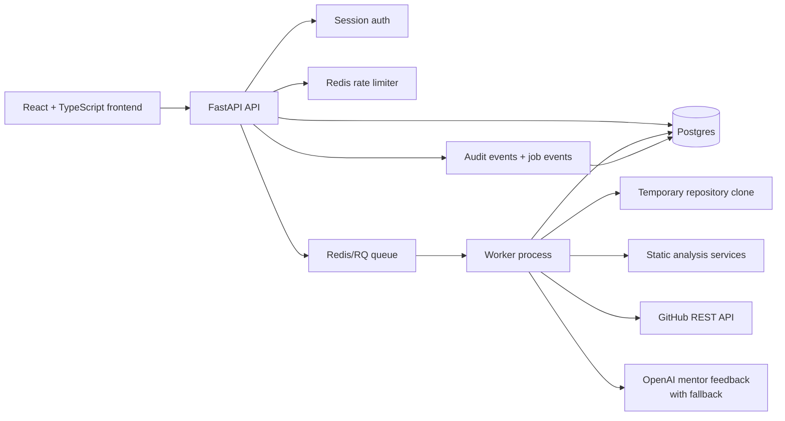

# Architecture

Repo Ready is a full-stack application with a React frontend, FastAPI API, Redis/RQ worker, Postgres database, and Redis-backed rate limiting/queueing.

## Runtime View

## Request Flow

1. The frontend submits a public GitHub URL to `POST /api/analyze`.
2. The API validates that the URL points to `github.com`.
3. The API resolves the current user from the HTTP-only session cookie, if present.
4. Redis-backed rate limiting checks the user or anonymous IP actor.
5. The API creates a persistent job row and records `analysis_started`.
6. Redis/RQ receives the job for worker execution.
7. The worker records job timeline events while cloning, analyzing, enriching, scoring, and generating mentor feedback.
8. The worker saves the analysis result and marks the job `done` or `failed`.
9. The frontend polls `GET /api/jobs/{job_id}` and can read `GET /api/jobs/{job_id}/events`.

## Backend Components

- `routes`: HTTP request validation, session lookup, authorization, rate limiting, and response shaping.
- `jobs`: job creation, queue handoff, worker orchestration, status updates, and timeline event recording.
- `worker`: starts an RQ worker connected to Redis.
- `db`: SQLAlchemy models and persistence methods for users, sessions, jobs, job events, audit events, and analysis history.
- `repo_loader`: clones public GitHub repositories into temporary workspaces.
- `analyzer`: inspects files, directories, languages, docs, tests, dependencies, CI, deployment config, and risk signals.
- `github_metadata`: enriches reports with public GitHub repository metadata.
- `readiness`: calculates deterministic resume readiness scores and checklist items.
- `action_plan`: turns missing signals into prioritized improvement tasks.
- `mentor_agent`: generates resume bullets, interview questions, and next steps through OpenAI or a deterministic fallback.

## Data Model

- `users`: local development user records.
- `sessions`: HTTP-only cookie session backing store.
- `analysis_jobs`: persistent async job state.
- `job_events`: ordered progress timeline for each job.
- `analysis_history`: saved final reports.
- `audit_events`: login/logout, rejected analysis requests, started analyses, and denied job views.

## Production Signals

- Long-running work is outside the API request path.
- Job status and progress are persisted, not only stored in memory.
- Access to history, job status, and job events is scoped by session user.
- Expensive analysis requests are protected by Redis rate limiting.
- Operational health is split into liveness and dependency readiness.
- Schema changes are explicit through Alembic migrations.
- AI feedback is optional; the deterministic fallback keeps demos and tests stable.

## Local Stack

Docker Compose runs:

- `frontend`: React app served through Nginx.
- `api`: FastAPI service running migrations before startup.
- `worker`: RQ worker running migrations before startup.
- `postgres`: persistent application database.
- `redis`: queue backend and rate-limit counter store.
